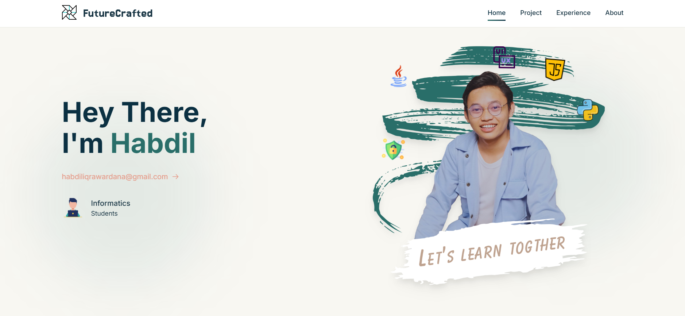

# 🚀 FutureCrafted Portfolio



Sebuah website portfolio personal yang modern dan elegan, dibangun dengan teknologi terkini untuk menampilkan perjalanan profesional saya dalam dunia teknologi.

## 🌟 Preview

Portfolio ini dapat diakses di: [https://portfolio-habdil.vercel.app](https://portofolio-habdil.vercel.app)

## 💻 Tech Stack

- **Framework:** [Astro.js](https://astro.build)
- **Styling:** [TailwindCSS](https://tailwindcss.com)
- **Deployment:** [Vercel](https://vercel.com)
- **Icons:** Custom SVG & React Icons

## 🎯 Fitur

- ⚡ Performa Optimal dengan Astro.js
- 🎨 UI/UX Modern dengan TailwindCSS
- 📱 Fully Responsive Design
- 🔍 SEO Optimized
- 📂 Project Showcase
- 💼 Experience Timeline
- 📝 About Section

## 🛠️ Instalasi & Setup

1. **Clone Repository**
```bash
git clone https://github.com/habdil/portofolio-habdil.git
cd portofolio-habdil
```

2. **Install Dependencies**
```bash
npm install
```

3. **Development Mode**
```bash
npm run dev
```

4. **Build untuk Production**
```bash
npm run build
```

## 📁 Struktur Proyek
```
/
├── src/
│   ├── components/
│   │   ├── sections/
│   │   │   ├── About.astro
│   │   │   ├── AllExperience.astro
│   │   │   ├── AllProjects.astro
│   │   │   └── ...
│   │   └── layout/
│   ├── pages/
│   │   └── index.astro
│   └── assets/
├── public/
│   └── assets/
│       └── images/
└── package.json
```

## 📌 Penggunaan

Proyek ini mencakup beberapa bagian utama:
- **Home:** Landing page dengan introduction
- **Projects:** Showcase proyek-proyek terkini
- **Experience:** Timeline pengalaman profesional
- **About:** Informasi personal dan kontak

## 🔧 Scripts

| Command           | Fungsi                                      |
|------------------|---------------------------------------------|
| `npm run dev`    | Start development server di localhost:4321  |
| `npm run build`  | Build proyek untuk production              |
| `npm run preview`| Preview hasil build                        |

## 📝 Kustomisasi

Untuk mengkustomisasi konten:
1. Edit file di `src/components/sections/`
2. Modifikasi data proyek di `AllProjects.astro`
3. Update pengalaman di `AllExperience.astro`
4. Sesuaikan informasi di `About.astro`

## 🚀 Deployment

1. Fork repository ini
2. Buat akun di [Vercel](https://vercel.com)
3. Import proyek dari GitHub
4. Deploy!

## 📫 Kontak

- Email: habdiliqrawardana@gmail.com
- GitHub: [@habdil](https://github.com/habdil)

## 📄 Lisensi

Proyek ini dilisensikan di bawah MIT License - lihat file [LICENSE](LICENSE) untuk detail.

---

<p align="center">Made with ❤️ by Habdil | FutureCrafted</p>
